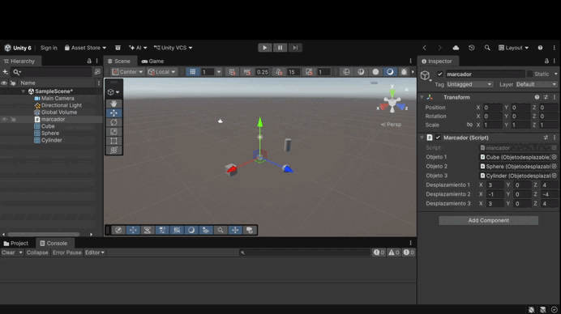
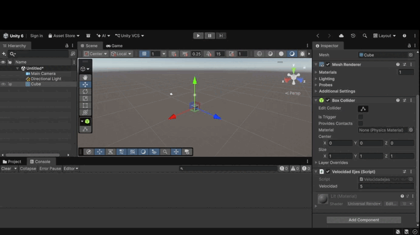
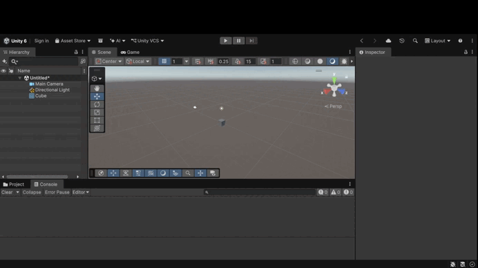
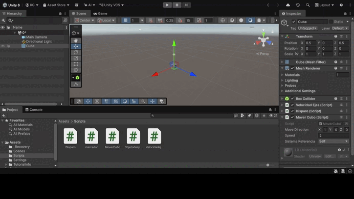
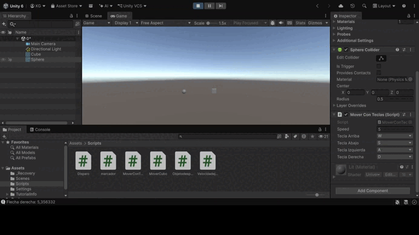
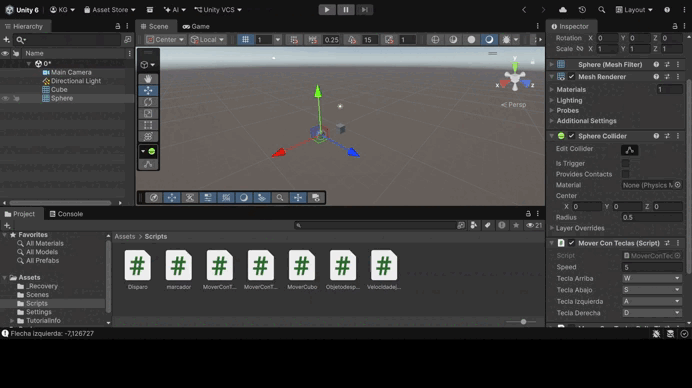
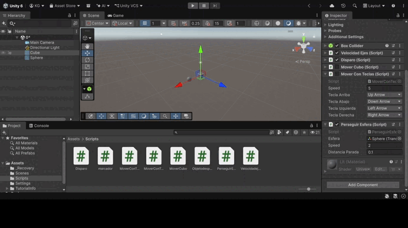
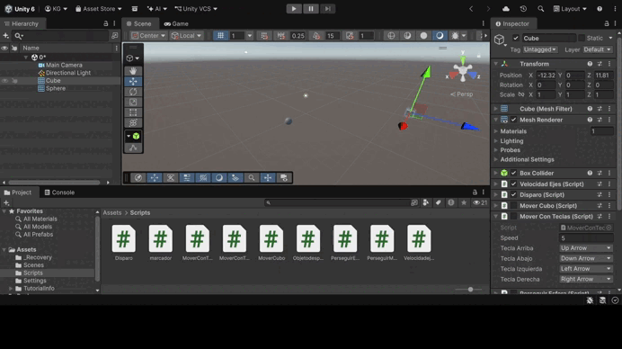
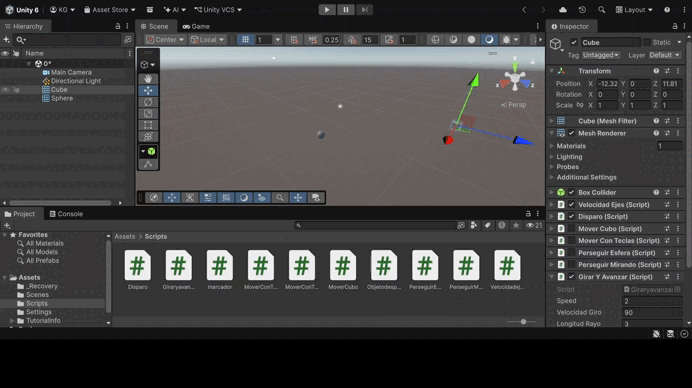

# Práctica de Unity: Entrada de usuario y movimiento

En esta práctica se desarrollan los ejercicios 5 a 13, centrados en la entrada de usuario y el movimiento de objetos en Unity. Se trabaja con las clases `Input` y `KeyCode`, la configuración del Input Manager, los métodos `Translate`, `Rotate` y `LookAt` de `Transform`, el escalado con `Time.deltaTime` y la normalización de vectores. Cada ejercicio incluye un GIF con la prueba de ejecución y el enlace a su script.

---

## Ejercicio 5: Posiciones configuradas con la barra espaciadora

Un objeto invisible (marcador) guarda 3 vectores de desplazamiento y los asigna a cada uno de los tres objetos de la escena, que tienen su propia variable pública `desplazamiento`. Al pulsar la barra espaciadora, detectada con `Input.GetAxis("Jump")`, cada objeto se coloca en su posición original más su desplazamiento. Al volver a pulsarla, regresan a su posición original.

📄 Scripts: [marcador.cs](Scripts/marcador.cs) · [Objetodesplazable.cs](Scripts/Objetodesplazable.cs)

---

## Ejercicio 6: Velocidad por el valor de los ejes

El cubo tiene un campo `velocidad` editable desde el Inspector. Al pulsar las flechas, se muestra en la consola el resultado de multiplicar la velocidad por el eje vertical (flechas arriba-abajo) o por el eje horizontal (flechas izquierda-derecha). El mensaje empieza por el nombre de la flecha pulsada.

📄 Script: [Velocidadejes.cs](Scripts/Velocidadejes.cs)

---

## Ejercicio 7: Tecla H para disparar

Desde **Edit → Project Settings → Input Manager**, en el eje **Fire1**, se cambia el *Positive Button* a `h`. El script solo usa el nombre del eje (`Input.GetButtonDown("Fire1")`), sin mencionar la tecla, y muestra un mensaje en la consola al disparar. Así la tecla de disparo se puede cambiar sin modificar el código.

📄 Script: [Disparo.cs](Scripts/Disparo.cs)

---

## Ejercicio 8: Movimiento con dirección y velocidad

El cubo se traslada en cada frame con `Translate(x, y, z)`, usando las coordenadas del vector `moveDirection` multiplicadas por `speed` y por `Time.deltaTime`. Ambos valores, y el sistema de referencia (local o mundial), se pueden modificar desde el Inspector.

📄 Script: [MoverCubo.cs](Scripts/MoverCubo.cs)

**Resultados obtenidos:**

1. **Duplicar las coordenadas de la dirección:** el cubo se mueve en la misma dirección, pero el doble de rápido. Como `moveDirection` no está normalizado, su longitud influye en el desplazamiento de cada frame.
2. **Duplicar la velocidad manteniendo la dirección:** el cubo también se mueve el doble de rápido en la misma dirección. El resultado es igual que en el caso anterior, porque el desplazamiento es `moveDirection * speed * Time.deltaTime`, y duplicar cualquiera de los dos factores duplica el producto.
3. **Velocidad menor que 1:** el cubo sigue moviéndose en la misma dirección, pero más despacio, porque el desplazamiento de cada frame es más pequeño. Con velocidad 0 se queda quieto y con una velocidad negativa se mueve en sentido contrario.
4. **Posición del cubo con y > 0:** el cubo hace el mismo movimiento, pero desde una altura mayor. Como no tiene Rigidbody, no le afecta la gravedad y no cae. Si la componente y de la dirección es 0, mantiene esa altura todo el tiempo.
5. **Movimiento local frente a mundial:** con *Space.Self*, el cubo se mueve según sus propios ejes, y con *Space.World*, según los ejes de la escena. Si el cubo no está rotado, ambos ejes coinciden y no se aprecia diferencia. Si se rota (por ejemplo, 45° en Y), en modo local avanza en diagonal respecto a la escena, siguiendo su orientación, y en modo mundial sigue moviéndose a lo largo del eje X de la escena.

---

## Ejercicio 9: Mover el cubo y la esfera con el teclado

El cubo se mueve con las flechas y la esfera con las teclas W-S (movimiento vertical) y A-D (movimiento horizontal), a la velocidad `speed`. Se usa un único script con las teclas configurables desde el Inspector. Se emplea `Input.GetKey` con teclas concretas en lugar de los ejes *Horizontal* y *Vertical*, porque estos responden a la vez a las flechas y a WASD y moverían los dos objetos juntos.

📄 Script: [MoverConTeclas.cs](Scripts/MoverConTeclas.cs)

---

## Ejercicio 10: Movimiento proporcional al tiempo del frame

El desplazamiento se multiplica por `Time.deltaTime`, el tiempo que ha tardado en generarse el último frame. Así el objeto recorre `speed` unidades por segundo, en lugar de por frame, y se mueve a la misma velocidad en cualquier ordenador, independientemente de los FPS. Una casilla en el Inspector permite desactivarlo para comparar ambos comportamientos.

📄 Script: [MoverConTeclasTime.cs](Scripts/MoverConTeclasTime.cs)

---

## Ejercicio 11: El cubo se mueve hacia la esfera

La dirección del movimiento es el vector que une el cubo con la esfera. Se anula su componente Y para que el cubo no cambie de altura y se normaliza con `.normalized`, de modo que el avance no depende de la distancia entre los objetos. El cubo se detiene al llegar para no temblar alrededor de la esfera.

📄 Script: [PerseguirEsfera.cs](Scripts/PerseguirEsfera.cs)

---

## Ejercicio 12: El cubo avanza mirando a la esfera

El cubo gira con `transform.LookAt` para que su eje Z positivo apunte a la esfera y avanza en esa dirección con `transform.forward` en el espacio del mundo. El punto al que mira está a la altura del cubo, para que gire solo en horizontal y no se incline. Las pruebas se hacen moviendo la esfera con W, A, S, D.

📄 Script: [PerseguirMirando.cs](Scripts/PerseguirMirando.cs)

---

## Ejercicio 13: Girar con el eje Horizontal y avanzar hacia delante

El cubo avanza siempre hacia delante y gira alrededor del eje Y con el eje *Horizontal* (flechas izquierda-derecha o A-D). Se usa `transform.forward`, el eje Z positivo del propio cubo, que cambia al girar, a diferencia de `Vector3.forward`, que siempre es el eje Z de la escena. Con `Debug.DrawRay` se dibuja una línea roja con la dirección de avance en la vista Scene.

📄 Script: [Giraryavanzar.cs](Scripts/Giraryavanzar.cs)
